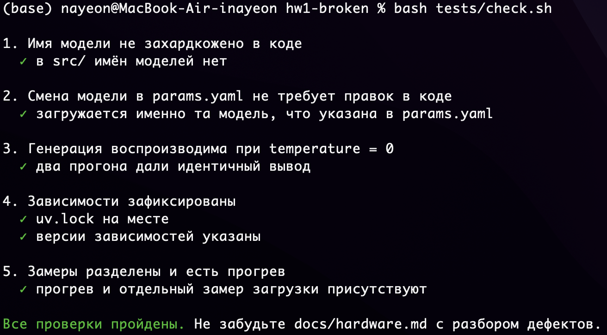
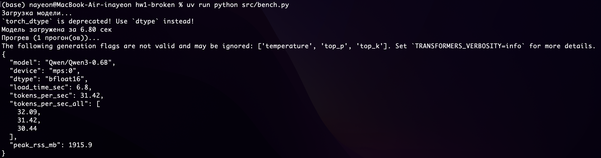

# ДЗ 1 — Окружение, первый инференс Qwen3, бенчмарк машины

## Что нужно сделать

1. Поднять окружение: `uv sync`, закоммитить `uv.lock`.
2. Заполнить `TODO` в коде.
3. **Найти и исправить четыре намеренных дефекта.** Симптомы описаны
   в задании; конкретные строки не указаны — искать нужно самим.
4. Прогнать `make bench`, определить свой профиль железа по таблице курса
   и записать выбранную модель в `params.yaml`.
5. Написать `docs/hardware.md`: результаты замера **и разбор каждого
   найденного дефекта** — в чём был, как проявлялся, как исправлен.
   Простое «починил» не засчитывается.
6. Согласовать с преподавателем тему своего датасета — понадобится в ДЗ 3.

## Запуск

```bash
uv sync
make generate     # генерация
make bench        # замеры
make check        # самопроверка — должна стать зелёной
```

## Результаты выполнения дз1

### Проверка tests/check.sh


### Замеры производительности (bench.py)


### Отчет hardware.md

---
