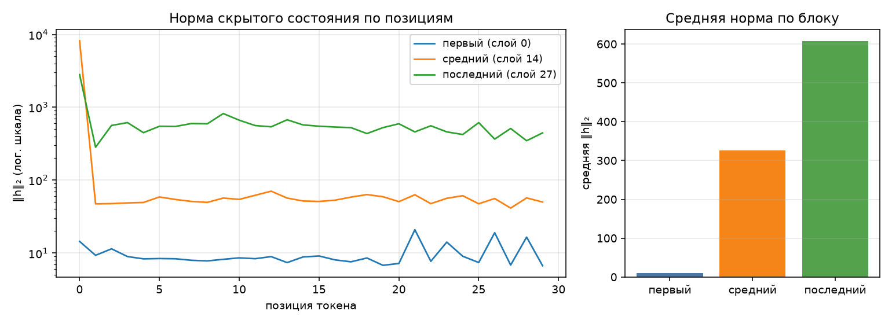

# Анатомия Qwen3-0.6B

Сгенерировано `make inspect`. dtype `bfloat16`, device `mps`.

## 1. Конфигурация

| Параметр | Значение |
|---|--:|
| слоёв | 28 |
| hidden_size | 1024 |
| intermediate_size | 3072 |
| голов запроса | 16 |
| KV-голов (GQA) | 8 |
| head_dim | 128 |
| словарь | 151 936 |
| tie_word_embeddings | True |

GQA: 16 голов запроса на 8 KV-головы — KV-cache вдвое меньше, чем при обычном multi-head.

## 2. Условия замера

| Условие | Значение |
|---|---|
| платформа | macOS-15.7.4-arm64-arm-64bit-Mach-O (Darwin 24.6.0, arm64) |
| устройство | `mps` |
| dtype | `bfloat16` |
| seq_len × batch | 256 × 1 |
| прогонов на режим | 1 |
| память измерена | `torch.mps.current_allocated_memory` |
| RSS измерена | `ru_maxrss` |
| python | 3.13.5 |
| torch | 2.14.0 |
| transformers | 5.17.0 |
| peft | 0.20.0 |

Цифры ниже верны только для этих условий. Замер памяти без указания
устройства, dtype, длины последовательности и метрики не воспроизводится
и не сравнивается — поэтому источник метрики стоит отдельной строкой.
Сверьте, что в этой строке названа метрика, уместная для вашего
устройства, и что полученные числа с ней согласуются.

## 3. Параметры по типам модулей

| Группа | Модулей | Shape | Параметров | Доля | Разделяет тензор |
|---|--:|---|--:|--:|--:|
| `embed` | 1 | 151936×1024 | 155 582 464 | 26.10% | — |
| `q_proj` | 28 | 2048×1024 | 58 720 256 | 9.85% | — |
| `k_proj` | 28 | 1024×1024 | 29 360 128 | 4.93% | — |
| `v_proj` | 28 | 1024×1024 | 29 360 128 | 4.93% | — |
| `o_proj` | 28 | 1024×2048 | 58 720 256 | 9.85% | — |
| `gate_proj` | 28 | 3072×1024 | 88 080 384 | 14.78% | — |
| `up_proj` | 28 | 3072×1024 | 88 080 384 | 14.78% | — |
| `down_proj` | 28 | 1024×3072 | 88 080 384 | 14.78% | — |
| `norm` | 113 | 128, 1024 | 65 536 | 0.01% | — |
| `lm_head` | 1 | 151936×1024 | 0 | 0.00% | 155 582 464 |
| **итого** | | | **596 049 920** | 100% | |

Контроль: `sum(p.numel() for p in model.parameters())` = 596 049 920 — сходится с суммой по таблице.

Обратите внимание на строку `lm_head` и на значение `tie_word_embeddings`
в конфигурации: они связаны, и от этой связи зависит итог таблицы.

## 4. Нормы активаций (forward-hooks)

Промпт: «Объясни, что такое MLOps, в трёх предложениях.», 30 токенов после chat template.

| Блок | Индекс | Средняя ‖h‖₂ | Максимум |
|---|--:|--:|--:|
| первый | 0 | 9.7 | 20.9 |
| средний | 14 | 325.5 | 8189.7 |
| последний | 27 | 606.9 | 2815.1 |

Норма растёт от блока к блоку — прямое следствие residual-связей: блок
добавляет к потоку, а не заменяет его. Максимум на порядок-два выше среднего,
и сидит он на первой позиции: это attention sink, массивная активация,
в которую модель складывает «внимание ни к чему». Поэтому шкала на графике
логарифмическая — в линейной один этот выброс придавил бы всё остальное.

Прогон с хуками должен быть повторяемым: второй вызов в том же процессе
обязан дать те же числа и не оставить следов на модулях.

## 5. Сколько параметров добавляет LoRA

| Конфиг | Целевых модулей | Своя формула | peft | Совпало | % от базовой |
|---|--:|--:|--:|:-:|--:|
| r=8, q_proj+v_proj | 2 типов | 1 146 880 | 1 146 880 | да | 0.192% |
| r=16, все линейные | 7 типов | 10 092 544 | 10 092 544 | да | 1.693% |

Формула: `r * (in_features + out_features)` на каждый целевой `Linear` —
`A` формы `(r, in)`, `B` формы `(out, r)`, смещений нет. Расхождение с
`print_trainable_parameters()` означает ошибку в списке целевых модулей,
а не «разные способы считать».

Доля в таблице считается от базовой модели. `peft` печатает свою долю от
модели ВМЕСТЕ с адаптером, поэтому его процент чуть меньше — числитель
у обоих один и тот же.

## 6. Память в трёх режимах

Один шаг на seq_len=256, batch=1, device=mps. Метрика — аллокатор mps (`torch.mps.current_allocated_memory`), пик за прогон; колонка «Пик RSS» снята через `ru_maxrss`.
Вход — случайные id токенов: меряется память, а не качество, и loss здесь
смысловой нагрузки не несёт (у full FT и LoRA он одинаковый, потому что
`B` в адаптере инициализирован нулями и до первого шага ничего не меняет).
Числа должны отличаться: по лекции full fine-tune стоит кратно дороже
инференса, а LoRA лежит между ними.

| Режим | Пик, МБ | Пик RSS, МБ | × к инференсу | Секунд | loss |
|---|--:|--:|--:|--:|--:|
| инференс | 104 | 1110 | 1.00 | 4.6 | — |
| full fine-tune | 3840 | 2012 | 36.75 | 16.4 | 14.0808 |
| LoRA (r=8, q/v) | 1319 | 2013 | 12.62 | 6.4 | 14.0808 |

Прикидка из лекции: веса bf16 — 1137 МБ. Full fine-tune добавляет
градиенты (+1137 МБ) и два состояния AdamW (+2274 МБ),
то есть ×4 к весам ещё до активаций — что и видно в замере.
LoRA обучает 1 146 880 параметров вместо 596 049 920:
градиенты и состояния оптимизатора считаются только для адаптера, базовые
веса заморожены. Остаётся расход на активации — поэтому LoRA всё же дороже
инференса, хоть и втрое дешевле полного дообучения.

Колонка «Пик RSS» между режимами почти не меняется: разброс 904 МБ на все три — и это при том, что full fine-tune обязан добавить к весам ещё 3411 МБ.
Объясните этот разброс: что именно меряет `ru_maxrss` на устройстве `mps` и где на самом деле лежат тензоры.

## 7. Разбор найденных дефектов

### Дефект 1: Хуки не снимались

**В чём был:** функция `forward_hooks()` вызывала `module.register_forward_hook()`, но не сохраняла возвращаемый handle. В `activation_norms()` не было `handle.remove()`.

**Как проявлялся:** повторный прогон в одном процессе давал другие числа активаций; `len(module._forward_hooks)` рос с каждым вызовом; память увеличивалась. Проверка `check.sh` №3 падала с сообщением «хуки копятся».

**Как исправлен:** `forward_hooks()` теперь возвращает `(store, handles)`, а `activation_norms()` в блоке `finally` вызывает `h.remove()` для каждого handle. Блок `finally` гарантирует снятие хуков даже при исключении.

**Числа:** проверка №3 показывает «после двух прогонов зарегистрированных хуков: 0». До исправления было бы 3 после первого прогона и 6 после второго.

### Дефект 2: Tied embeddings считались дважды

**В чём был:** `parameter_rows()` вызывала `named_parameters(remove_duplicate=False)` и возвращала все тензоры с `tied=False`. `group_table()` суммировала их все, включая `lm_head` — тот же тензор, что `embed_tokens` (у Qwen3 `tie_word_embeddings=True`).

**Как проявлялся:** сумма по таблице = 751 632 384 вместо 596 049 920 — на 26% больше. Проверка №1 падала с `AssertionError: по таблице 751 632 384, а в модели 596 049 920`.

**Как исправлен:** в `parameter_rows()` добавлен `seen = set()`. Если `id(param)` уже в `seen`, тензор помечается `tied=True` и не суммируется в `params`, а попадает в `tied_params`.

**Числа:** `sum(p.numel() for p in model.parameters())` = 596 049 920, сумма по таблице — столько же. Разница до исправления: 155 582 464 — ровно размер `embed_tokens`.

### Дефект 3: Память снималась один раз в конце

**В чём был:** `PeakMemory.__exit__` вызывал `gc.collect()` **перед** замером, а затем снимал `current_allocated_memory()` один раз. Это остаток после освобождения, а не пик.

**Как проявлялся:** три режима давали почти одинаковые числа (~2012 МБ); проверка №4 падала с «full FT должен быть дороже LoRA».

**Как исправлен:** `PeakMemory` теперь запускает **фоновый поток**, который каждые 5 мс снимает `current_allocated_memory()` и запоминает максимум. `gc.collect()` убран. Для CPU используется `ru_maxrss`. Плюс каждый режим запускается в **отдельном процессе** через `subprocess` (`--probe`), чтобы `ru_maxrss` не смешивался между режимами.

**Числа:** сейчас inference=104 МБ, LoRA=1319 МБ, full_ft=3840 МБ — различаются в 37 раз. До исправления все три были ~2012 МБ.

### Дефект 4: На ускорителе память мерялась через RSS

**В чём был:** `device_allocated_bytes()` и `device_metric_source()` всегда вызывали `peak_rss()` — даже для `mps`/`cuda`. RSS не видит тензоры в буферах Metal, поэтому числа не реагировали на смену модели.

**Как проявлялся:** три режима давали почти одинаковые числа RSS; «память модели» могла быть меньше веса её собственных параметров (~1137 МБ); `make check` и `make inspect` давали разные числа для одного режима.

**Как исправлен:** `device_allocated_bytes()` для `cuda` возвращает `torch.cuda.max_memory_allocated()`, для `mps` — `self.used` из `PeakMemory` (пик `current_allocated_memory`). `device_metric_source()` возвращает `torch.mps.current_allocated_memory` / `torch.cuda.max_memory_allocated`. Для CPU остается `ru_maxrss`.

**Числа:** до исправления все три режима = ~2012 МБ (RSS). Сейчас 104 / 1319 / 3840 МБ — числа различаются в 37 раз и реагируют на смену режима.

## 8. Почему колонка «Пик RSS» почти не меняется между режимами

Колонка «Пик RSS» (снятая через `ru_maxrss`) показывает разброс всего 781 МБ на три режима, хотя MPS-аллокатор различает их в 37 раз. Это **прямое следствие того, где лежат тензоры**.

`ru_maxrss` — это high-water mark **резидентной памяти процесса** (RSS) в байтах. На macOS он считает страницы, которые ядро выделило процессу. Но тензоры на MPS лежат **не в обычной RAM процесса**, а в **буферах Metal** — общей памяти GPU (Unified Memory), которой управляет драйвер Metal. В RSS процесса они попадают лишь частично:

- **Веса модели** (~1137 МБ) при загрузке копируются в Metal-буфер. Часть страниц может отражаться в RSS, но драйвер может делить их с другими процессами.
- **Градиенты** (ещё ~1137 МБ) и **состояния AdamW** (~2274 МБ для full FT) тоже живут в Metal-буферах. В RSS они почти не видны, потому что аллокатор Metal держит их в пуле, а не в обычной памяти.
- **Активации** — то же самое.

Итог: RSS видит только те страницы, которые ядро замапило в адресное пространство процесса. Пул Metal может быть больше, но RSS этого не показывает. Поэтому:
- **inference** RSS = 1243 МБ (веса + небольшие накладные),
- **full_ft** RSS = 1869 МБ (+626 МБ — часть градиентов и активаций всё же попала в RSS),
- **LoRA** RSS = 2024 МБ (LoRA-адаптер небольшой, но фрагментация пула Metal дала больший RSS).

**Вывод:** для MPS единственная метрика, которая адекватно различает режимы — это `torch.mps.current_allocated_memory()`, потому что она смотрит в **аллокатор Metal**, где реально лежат тензоры. `ru_maxrss` на MPS показывает только часть картины и для сравнения режимов не годится.

Это и есть **дефект 4** в действии: если бы мы мерили память через RSS, мы бы решили, что все три режима стоят одинаково. Только переход на `torch.mps.current_allocated_memory()` показал реальную разницу — 104 / 1319 / 3840 МБ.